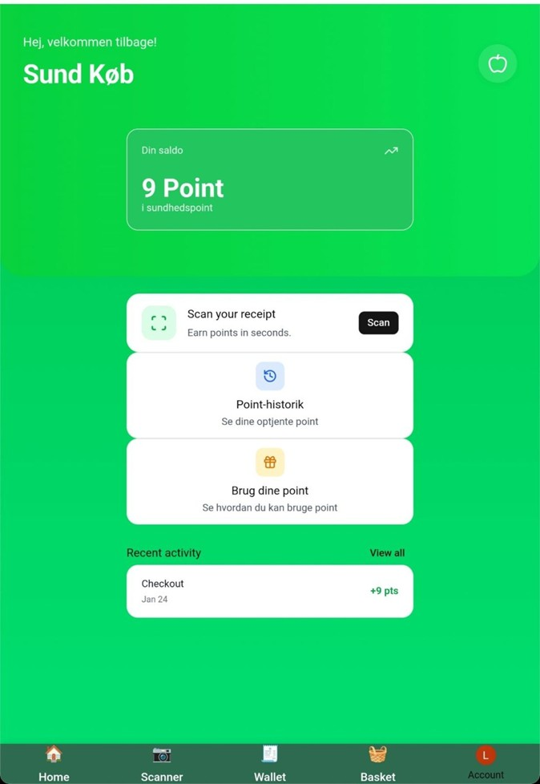
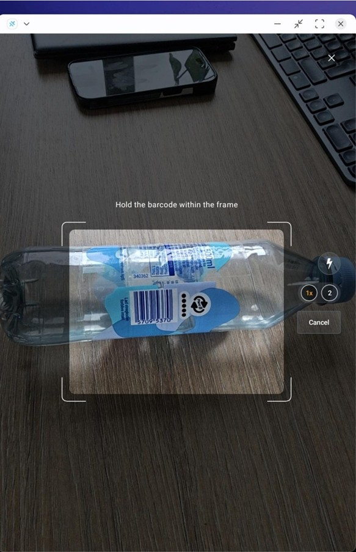
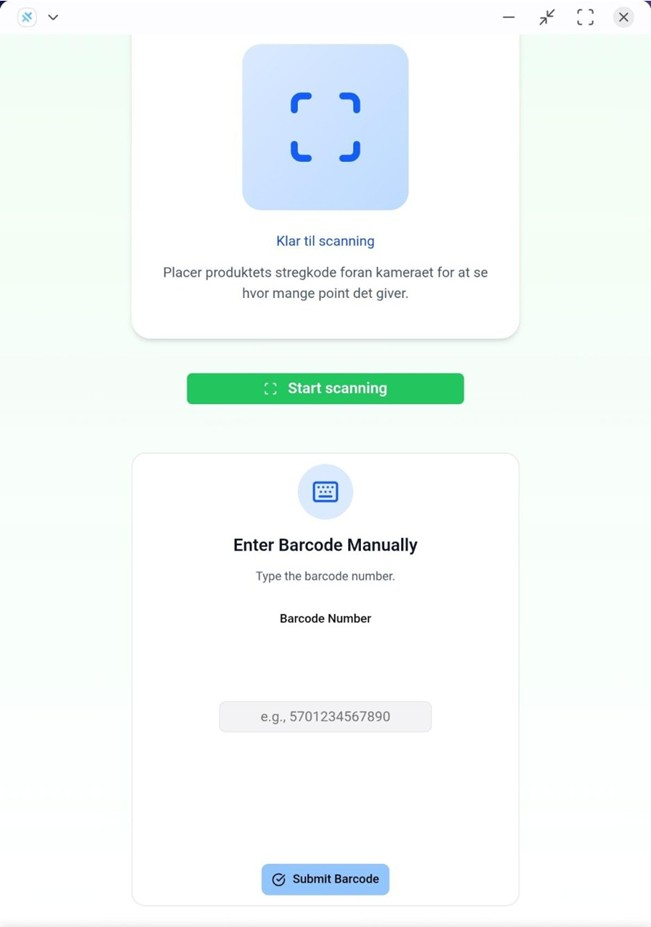
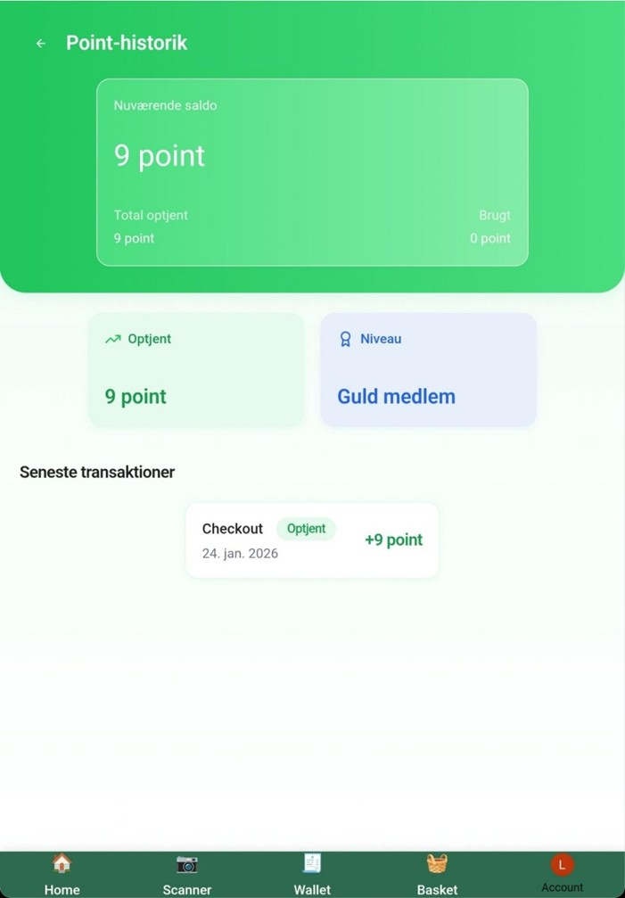

# Cashback App (MVP)

A Vite + React + TypeScript demo app for a cashback/points experience.
UI uses Tailwind CSS and shadcn-style components in `src/ui/*`.

## MVP Scope (<=10 pages)
As of 2026-01-22, the MVP demo includes these pages only:
- Home
- Login (Clerk)
- Dashboard (scan entry + summary)
- Scan / Manual Entry flow
- Product Details
- Basket + Checkout (combined for MVP)
- Wallet (points balance + ledger)
- Rewards List
- Reward Details

Out of scope for MVP demo: history page, settings, admin tools, and any non-core flows.

## Demo Success Criteria
- A user can go from login to scanning/entering a product and see details.
- Products can be added to a basket and checked out to award points.
- The Wallet shows an updated points balance and ledger entry after checkout.
- A reward can be redeemed and points decrease accordingly.
- Error/empty states are shown for missing products or insufficient points.

## Quickstart (Frontend)
1) Install dependencies:
   - `npm install`
2) Run the dev server:
   - `npm run dev`
3) Open the app:
   - http://localhost:5173

Other useful commands:
- `npm run build`
- `npm run preview`
- `npm run lint`

## Environment Variables
Copy `.env.example` to `.env.local` and fill in the Convex + Clerk values.
These are placeholders until Convex/Clerk are wired in.

## Formatting
There is no Prettier configuration yet. Use `npm run lint` and keep
formatting changes minimal and consistent with nearby code.

## Backend (Convex)
Convex is planned but not wired yet. The `convex/` directory is a placeholder and
there is no schema or client/provider in the frontend. Task 4 adds Convex, at
which point this section will include deployment + local dev instructions.

## Project Structure (high level)
- `src/pages/` route pages
- `src/components/` shared UI pieces
- `src/ui/` shadcn-style UI components
- `src/scanner/` scan flow UI
- `convex/` backend functions (planned)

## Styling Approach
Global styles live in `src/styles/globals.css` (Tailwind + design tokens).
Avoid adding additional global CSS files; prefer Tailwind and `src/ui/*`.

## Screenshots

### Home Page

### Barcode Scanning

### Manual Barcode Entry

### Point History

